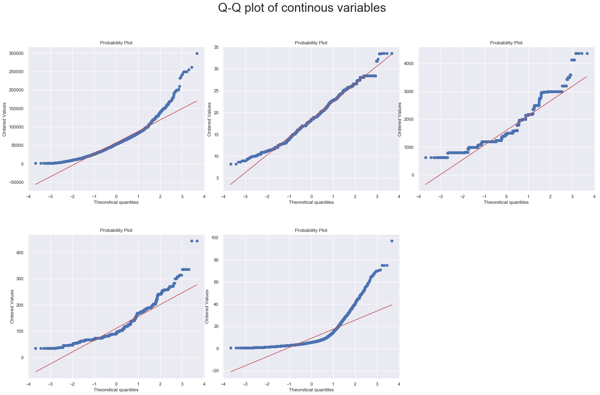
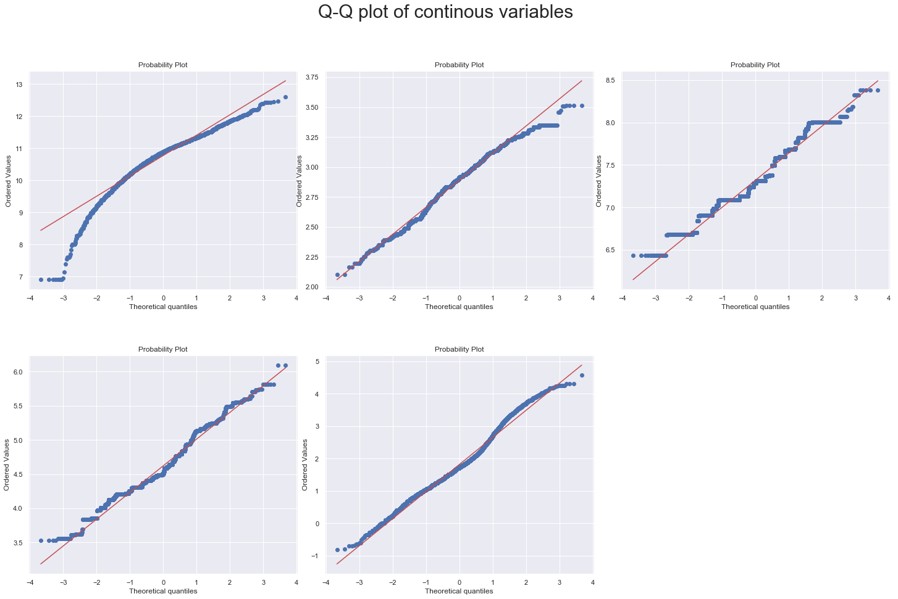
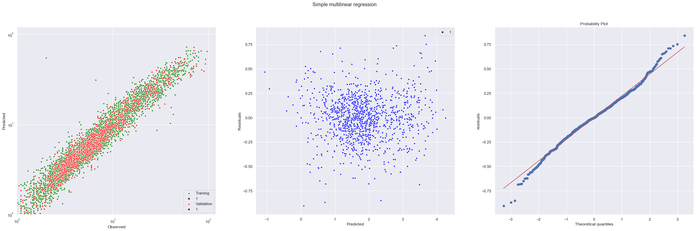

# predicting-the-costs-of-used-cars


*working App developed using Flask*

 Dataset used here is from a hackathon hosted by MachineHack. Dataset contains around 6000 cars examples and has features like Location, Manufacture details, car features such as Fuel type, Engine, and usage parameters. sample is shown here. Some features are numeric attached with units and they need to be removed

 

 Quick data availabilty summary:


## Data exploration 

### Name

Top 10 cars and there brands:

1. Mahindra XUV500 W8 2WD        49
2. Maruti Swift VDI              45
3. Maruti Swift Dzire VDI        34
4. Honda City 1.5 S MT           34
5. Maruti Swift VDI BSIV         31
6. Maruti Ritz VDi               30
7. Hyundai i10 Sportz            30
8. Toyota Fortuner 3.0 Diesel    29
9. Hyundai Grand i10 Sportz      27
10. Honda Amaze S i-Dtech         27


* There are over 1800 varities of cars. Some are widely owned and some are rare.
* Roughly, 800 cars makes up 80% and rest 1000 only occupies 20%.
* There will be lot of categories to handle if we use the feature as it is.

#### > Split 'Name" into Brand and Model 

If we observe the cars name, First word in the Names corressponds to **Brand** and rest of it corresponds to Model name, series. Along with "brand" we need to decide how many words to keep after **Brand** which makes **Model** feature.

Lets see how many categories we get upon adding 2nd word alone and 2nd and 3rd word together.


* no of unique values  when when only 2nd word is considered: 212
* no of unique values when 2nd and 3rd word is considered together: 689

We are creating lot of catgories if we go with second option, in order to keep it simple I used only first option of Model feature.

Lets look at cumulative count dist plots:


* Just 8 Brands make up 80% and rest occupies 20%
* Roughly, 55 Models make up 80% and rest occupies 20%

### Distribution of catgorical features


### **summary**:

**Location**: Mumbai has highest cars sellers and Amdhabad has least with no significant count diffenerce across categories. One Hot encoding would add 22 extra features, May be mean encoding could be used but confirmed if we find price distribution across cities.

**Year**: Recent years has high contributon i.e models manufactered over this period are high traded. Since variable is ordinal encoded we could tranform by curr_year(2019)-year meaning older the car more is drepriciation.

**Fuel_type**: Desieal and Petrol contitutes more. Onhot-encoding only for Desiel and pentrol would work fine.

**Trnasmission**: Manual transmission cars is More We could use Lable encoding (Same as binary encoding)

**Owner_type**: First time owners are more about 90%. one hot encoding for fist two categories would work.

**Seats**: Most cars are 5 seaters.

### Distribution of continous variables


* Except Milage feature, rest are highly positive skewed including target variable. Let look at Q-Q plot that checks normality.



From the above plot it is evident that features are not normally distributed. If we intend to fit data to non-tree based ML models like Linear regression we need remove skewness in the data and make transform them to closely follow normal distribution.


Lets create the above two plots with log transformation.




Log tranformed features looks better in shape compared to original form.

### Freauency plot of categorical variables


* Muruti, Hyundai and Honda remians top brands across major cities in india.

* Majority of cars sold are recently manufactered after 2010, with 2016 year being highest.

* Finding on other features are no different from the one already stated.

Lets take a look at how continous features vary across different brands. I have considered top 8 brands for simplicity as there so many brands.


There should exist variability across the models which makes good for prediction and this variability should be consistent wih the variabilty observed with the target varaible.

* distribution Eninge capacity and power are consistent with target variable **price** and with each other as well. It is expected that higher the engine capacity and power higher will be the price.

* When it comes to milage It has inverse relation with the target. brand distribution shift up in the milage plot and shift lower in the price plot indication as opposed to belief that higher milage fetch higher price. It could causation effect, in general milage may not influence on the price.

The stroy is no diiferent for **model** case 


## Compare prices across cities 


Plot says on overall Coimatore is highest in paying for used cars, and Jaipur and Kolkata lowest. This could mean  coimatore is paying comparitively higher prices or coimatore is in forefront in buying expensive cars which pushes the city to the top and vice versa for Jaipur and Kolkata.

In order to find out, let's compare the prices for individual models across the cities.


Similar pattern exist even within the models. That means Coimaore is indeed paying compartively higher prices than counter parts. Opposite beviour can be noticed Jaipur and Kolkata here as well.

## Compare prices across purchase year

General intuiation is that car purchased in a particular year should fetch more price than the one purchsed earlier.  let create a plot similar to prevoius one but for **year** check whether its true or not.


Prices reducing as we move further away in a linear fashion which conforms our hypotheses.

###  Target variablity within categorical features

In categorical features *Fuel_type* and *Owner_Type* some categories counts are relatively low (<5%) upon one-hot encoding categorical columns increases dimensionality. Question is, is it worth it to add these columns ? to answer we could look at how much extra information these columns add.


The minor categories **CNG** and **LPG** distributions of *Fuel_type* are different (mean is slightly below and std dev is much less) from the other two hence inclusion of these can add more information. These two can be combined into single category and included.

Where as minor categories **Third** and **Fourth & Above** mean values of *Owner_Type* do not differ much hence can be dropped. No evidence that 

### variability aross Seats feature


* Interestly, mean price for 2-seater vehicle are way higher than the others. Mostly, 2 seater cars in our dataset fall under luxury category. But, given its count is comparatively low (just 11), it cannot be universally accepted. 

### Correlation plot
Let's see how are continous dependent variables related with each other and with target variable.


* surpursingly Kilometers_Driven doesn't seem to influence target variable and Mileage negatively affects price which could be result of caustion discussed earlier.

* Both Engine and Power have strong correlation with taget  and Also with each other which is pretty inituitive as higher engine capacity imply higher power. 

* There exists a multicolinearity between Engine capacity and power.

## Correlation plot 


* Engine volume and Power has a strong association with the price.

* Where as Price is not impacted much by Kilometer_driven and Mileage. 

## Interaction between continous variables


* Even Engine volume and Power combined has a strong positive association with the price which is obvious.

* Rest other doesn't seem to have impact on the price.

* Interestingly, features milage and Kilometer_driven which do not have effect on the price individaul shows a signinificant negative correlation in combination.

### Testing Multicollineaity 

Linear regression models get adresly effected in the presence of multicollinear features. If model primary purpose is interpretability then having multicollinear features
make model (co effiecients) less reliable and sometimes even misleading.

#### VIF test

VIF is the widely used test for checking multicollinearity in the data. VIF measures dependence of features with others by fitting regression line. basically it tries to quantify amt of change in target response with change in linear combination of other variables. It uses R-square metric to compute VIF (1 / (1 - R-square)). VIF < 5 (R-square = 0.8) is aceptable more than that indicate colinearity.

Test is perfomed on continous variables subset iteratively. Results of VIF test run on Mileage, Engine, Power:

```Variance Inflation Factor of Kilometers_Driven column is 1.02```

```Variance Inflation Factor of Mileage column is 1.73 ```

```Variance Inflation Factor of Engine column is 6.78``` 

```Variance Inflation Factor for Power column is 5.23 ```

```Variance Inflation Factor of Seats column is 1.69 ```

seems like *Engine* and *Power* exibits high multicolineaity i.e strong association with the rest of the features.


### Anova to test for Assocition IVs with DV

t-test is for comparing mean of two samples (two categories in a feature) While Anova compares means of multiples samples (more than two categories). when only two categories in a feature either of them can be used. 

Idea here is that, in order to tell a categorical feature associated with the target there should be variation in target distribution across the categories i.e target distribution correponding to each of the category.

Assumtions:
* Obersevations are IIDs (independent identical distributed)

* samples follow normal distribution.

* both samples must have equal variance (homogenity)


``` python
Brand:
F_onewayResult(statistic=294.9573908330804, pvalue=0.0)
Model:
F_onewayResult(statistic=122.4073799480774, pvalue=0.0)
Location:
F_onewayResult(statistic=74.05390489637388, pvalue=1.24184135441653e-143)
Fuel_Type:
F_onewayResult(statistic=481.29653853627354, pvalue=3.513024865550255e-280)
Transmission:
F_onewayResult(statistic=3660.5079482274805, pvalue=0.0)
Owner_Type:
F_onewayResult(statistic=84.16775431316191, pvalue=2.4548585135147553e-53)

```

## Handling missing values


Firstly, *New_Price* feature has 824 values filled out of 6019. This feature could have been important one as customer takes into market price before deciding whether used car quoted price is resonable or not. Since we don't have much information on this dropping the feature is acceptable.

There are some values missing in *Mileage*, *Engine*, *Power*, *Seats* too though not significant. First three continous varaibles are imputed with mean and mode for last variable which is categorical. Instead of imputing with coulmn satistic we could impute with group mean of the *model* category missing example belongs to, seems more appropriate. let plot to see whether group feature distribution is significatly different across various categories.


Plot of feature distribution across model categories. Note range vary across model and even within model there has significance varience with sharp peaks indicates m0ost likely value. I am filling the missing cells mode value of group filtered by *model* category.

## Building Building

### Feature Engineering

**Features:**
* **Brand**: Since there are hundreds of categories which are nominal *Target encoding* is applied for brands.

* **Model**: Teartment is same as applied for *Brand* feature.

* **Location**: There are 24 cities in our dataset we could apply one-hot encoding. However, ealier we have seen a mean price difference acorss cities overall and for individual models so there exist some order. This information can be best encoded using *Label encoding* or *Target encoding*. Target encoding seems more appropriate as it also encodes difference along with order.

* **Year**: plot showed that *Year* feature linearly associated with the *Price* i.e for same model older car fetches less price than new car. So meaningfully represented by deducting *Year* with current year (2019), lower the value newer the car and vice versa.

* **Fuel_Type**: It consists 5 nominal categories we can go with one-hot encoding. Since *Diesel* and *Petrol* forms majority, dropping the other three will not have much impact.

* **Transmission**: *Binary encoding* as it caonsits only two categories.

* **Owner_Type**: Out of Four categories *First* and *Second* form majority, they can be one-hot encoded and  other two can be dropped.

* **Seats**: used as it is

### Feature Transformation 
The feature distribution plots showed that our variables are highly positve skewed. To make them fairly symmetric  our features are *log tranformed*. this tranformation works well for both regression and tree based algorithms.

### 


### Feature Selection

A feature selection technique called **Recursive Feature Selector** has been used to filter out irrelevant features. It recursively fits with the data with target and eliminates feature that degrades model performance.

## Model Pipeline

Pipeline stores all the hyperparmeters across various processing stages making it productionalize. Sklearn's pipeline is useful in streamlining all the steps involved in the model building right from cleaning and preprocessing to till model selection. pipeline is allows easy experimenting with various options. Pipeline objects can be shared and exported for deployment.

the components of pipeline that helps in streamlining processes are called **Custom transformers**. Custom transformers is built to apply reqiured transformation on to data by using *TransformerMixin* and *BaseEstimator* base classes. Inheriting from TransformerMixin ensures that all we need to do is write our fit and transform methods and we get fit_transform for free. Inheriting from BaseEstimator ensures we get **get_params** and **set_params** for free. These tranformers forms components of model pipeline.

Here is an example of custom tranformer. It takes a Dataframe and returns dataframe with multicollinear features removed.

``` python
class DF_RemoveMulticolinear(BaseEstimator, TransformerMixin):
    # Checks for multicolinear features existance and removes them recusively  

    def __init__(self, thresh = 5):
        self.thresh = thresh

    def fit(self, X, y=None):
        # stateless transformer
        cols = X.columns
        variables = np.arange(X.shape[1])
        dropped=True
        while dropped:
            dropped=False
            c = X[cols[variables]].values
            vif = [variance_inflation_factor(c, ix) for ix in np.arange(c.shape[1])]

            maxloc = vif.index(max(vif))
            if max(vif) > self.thresh:
                print('dropping \'' + X[cols[variables]].columns[maxloc] + '\' at index: ' + str(maxloc))
                variables = np.delete(variables, maxloc)
                dropped=True

        print('Remaining variables:')
        print(X.columns[variables])
        self.cols = X.columns[variables]
        return self

    def transform(self, X):
        return X[self.cols]
```

### Model building pipeline

``` python
# columns segregation
Tar_cols = ['Brand', 'Model', 'Location'] # target encoding columns
con_cols = ['Kilometers_Driven','Mileage', 'Engine', 'Power'] #continuous variables
One_hot_cols = ['Fuel_Type', 'Transmission', 'Owner_Type'] #one hot encoding columns
Year = ["Year"] # year columns
Seats = ["Seats"] # seat coulmn
```

#### R-squared intuition
hard to realize if our model is good or not by looking at the absolute values of MSE given different problems have different scales so R-Square is better metric than former.

We would probably want to measure how much our model is better than the constant baseline.

R-squared tells us what percent of the prediction error in the y variable is eliminated when we use least-squares regression on the x variable instaed of just taking mean of y variable.
a = sum((y - y_mean)2) is bench mark and

b = sum((y - y_estimate)2) is LSE

1-b/a is R-square or coefficient of determination.

R square is scale free (0-1) means we don't have to know about y range to decide whether it the best unlike RMSE (scale independent).

### Regression analysis

Residual analysis:
Since regression tries to fit a best line through the data points. It because of skewness model could be biased i.e it perform well in the region where data points are highly concentrated (low residuls) and bad in the region where data points are rare extreme ends. In order to examine we can plot residulas (y - pred) along the domain range.

residual plot gives a sense of how good a fit is across the x range.

A good model always produces residuals independent, evenly scattered around and close to zero line and should not show trend.

If we see a trend in residual plot we may have to use non linear or more complex models.


Points to remember:

* Linear regression assumes data is free from multicolineartity it is necessary to remove colinearity from our data to build robust model. Otherwise it would make coefficients less reliable and even misleading sometimes.

* Data follows normal distribution and is on common scale.

* Linear regression expects X data to be normal distributed, however, there is no such assumtion on target (y). If residual satisfy the creteria such as normality, homoscadasticity, no autocorrelation.

* Skewness in the target variable is an issue in standard linear regression provided that some predictor variables are also appropriately skewed so that residuals are not skewed. Transformation of both predictor and target variables is often needed to meet the assumptions of a linear regression and to produce well-behaved residuals.

When Liear Regression should not be used:

The sensible use of linear regression on a data set requires that four assumptions about that data set be true:

* The relationship between the variables is linear.
* The data is homoskedastic, meaning the variance in the residuals (the difference in the real and predicted values) is more or less constant.

* The residuals are independent, meaning the residuals are distributed randomly and not influenced by the residuals in previous observations. * If the residuals are not independent of each other, they’re considered to be autocorrelated.

* The residuals are normally distributed. This assumption means the probability density function of the residual values is normally distributed at each x value. I leave this assumption for last because I don’t consider it to be a hard requirement for the use of linear regression, although if this isn’t true, some manipulations must be made to the model.


```
                            OLS Regression Results                            
==============================================================================
Dep. Variable:                      y   R-squared:                       0.932
Model:                            OLS   Adj. R-squared:                  0.932
Method:                 Least Squares   F-statistic:                     5468.
Date:                Wed, 29 Apr 2020   Prob (F-statistic):               0.00
Time:                        22:30:34   Log-Likelihood:                 306.25
No. Observations:                4793   AIC:                            -586.5
Df Residuals:                    4780   BIC:                            -502.3
Df Model:                          12                                         
Covariance Type:            nonrobust                                         
===============================================================================================
                                  coef    std err          t      P>|t|      [0.025      0.975]
-----------------------------------------------------------------------------------------------
const                           1.8211      0.003    554.669      0.000       1.815       1.828
Power                           0.1986      0.007     28.972      0.000       0.185       0.212
Kilometers_Driven_&_Mileage    -0.0384      0.005     -8.504      0.000      -0.047      -0.030
Fuel_Type_Diesel                0.0084      0.016      0.518      0.605      -0.023       0.040
Fuel_Type_Petrol               -0.0733      0.016     -4.536      0.000      -0.105      -0.042
Transmission_Manual            -0.0584      0.005    -12.389      0.000      -0.068      -0.049
Owner_Type_First                0.0330      0.009      3.510      0.000       0.015       0.051
Owner_Type_Second               0.0073      0.009      0.801      0.423      -0.011       0.025
Brand                           0.1456      0.007     21.799      0.000       0.133       0.159
Model                           0.3115      0.009     35.979      0.000       0.295       0.329
Location                        0.0711      0.003     20.485      0.000       0.064       0.078
Year                           -0.3015      0.004    -73.500      0.000      -0.310      -0.293
Seats                           0.0044      0.004      1.155      0.248      -0.003       0.012
==============================================================================
Omnibus:                     1362.213   Durbin-Watson:                   2.012
Prob(Omnibus):                  0.000   Jarque-Bera (JB):            28827.420
Skew:                          -0.840   Prob(JB):                         0.00
Kurtosis:                      14.896   Cond. No.                         13.6
==============================================================================

Warnings:
[1] Standard Errors assume that the covariance matrix of the errors is correctly specified.


 Linear Regression R-Squared: Training = 0.835, Validation = 0.804

 Linear Regression SCORE: Training = 0.811, Validation = 0.814
```

Interpretting Regression results
* regression coeff - determines change in target value per unit change in independent variable.

* p - value: decides whether varible has influence on target. If p-val < 0.05, Null hypothesis can be rejected i.e strong evidence. In other words, variables with low p-value are likely to be meaning additions to our model. In our case, *Fuel_Type_Diesel*, *Owner_Type_Second*, and *Seats* are not likely cadidates.

* If interprtation is primarey concern, i.e how variables individually affect target, then you must get rid of multicolinear variables (generally correlation >0.8). but for model performance not get affected by existance of colinear variables.



* Looking at Residual plot, It can be infered Data is exibiting heteroscadasticity hence linear is not appropriate. Take a look at some  non linear models. perhabs my data has high varaibilty at higher levels.

* Looking at features that are Tree based algorithms are best suited for this process as most of the varibles are discrete in nature (including Power and Engine).

* Kind of the dataset, regression may not be best model.


### Best model 
* The data was fit with various algorithms. The best model turnout to be GBM with following hyperparmeters.


``` python
TransformPipeline_GBM = Pipeline([
    ('features',DFFeatureUnion([
        ('numerics', Pipeline([
            ('extract',ColumnExtractor(con_cols)),
            ('log', Log1pTransformer()),
            ('col_Interact',DFadd_ColInteraction('Kilometers_Driven','Mileage')),
            ('col_drop',DFdrop_Cols(cols=['Kilometers_Driven','Mileage','Engine']))])),
        ('nominal_OneHot',Pipeline([
            ('extract',ColumnExtractor(One_hot_cols)),
            ('dummy',DummyTransformer())])),
        ('nominal_Target', Pipeline([
            ('extract',ColumnExtractor(Tar_cols)),
            ('Mean_Enc',TargetEncoder())])),
        ('Year',Pipeline([
            ('extract',ColumnExtractor(Year)),
            ('Shift',ShiftTranformer(par=2019))])),
        ('Seats',Pipeline([
            ('extract',ColumnExtractor(Seats))]))
            
        ])),
    ('feature_selection',DFRecursiveFeatureSelector(RandomForestRegressor(n_estimators=50),n_features=20)),
    ('Model_fit',DF_Model(estimator = GradientBoostingRegressor()))])
```
The best model was across hyperparameters space and final seleted one with **r2** score.

``` python
pipe_params= {'Model_fit__estimator__learning_rate':[0.2,0.4,0.6,0.8],
              'Model_fit__estimator__n_estimators':[20,40,80,100,120],
              'Model_fit__estimator__min_samples_split':[20,40,60],
              'Model_fit__estimator__max_depth':[3,4,6,8,12],
              'Model_fit__estimator__min_samples_leaf':[20,40,60],
              'feature_selection__n_features':[10,15,20]
              }

GBM_Regressor = GridSearchCV(TransformPipeline_GBM,
                         param_grid=pipe_params,
                        scoring = 'r2',
                            n_jobs = 5,
                        cv = 3,verbose=50)
GBM_Regressor.fit(X_train,y=np.log(y_train))
```

Best parametes:
``` python
{'Model_fit__estimator__learning_rate': 0.2,
 'Model_fit__estimator__max_depth': 4,
 'Model_fit__estimator__min_samples_leaf': 20,
 'Model_fit__estimator__min_samples_split': 40,
 'Model_fit__estimator__n_estimators': 120,
 'feature_selection__n_features': 20}
```

``` python
 GBM R-Squared: Training = 0.973, Validation = 0.96

 GBM neg_mean_squared_error SCORE: Training = 0.98, Validation = 0.972
```

## Best Model

### Pipeline Config 

``` python
pipeline = Pipeline([
    ('features',DFFeatureUnion([
        ('numerics', Pipeline([
            ('extract',ColumnExtractor(con_cols)),
            ('log', Log1pTransformer()),
            ('col_Interact',DFadd_ColInteraction('Kilometers_Driven','Mileage'))
        ])),
        ('nominal_OneHot',Pipeline([
            ('extract',ColumnExtractor(One_hot_cols)),
            ('dummy',DummyTransformer())])),
        ('nominal_Target', Pipeline([
            ('extract',ColumnExtractor(Tar_cols)),
            ('Mean_Enc',TargetEncoder())])),
        ('Year',Pipeline([
            ('extract',ColumnExtractor(Year)),
            ('Shift',ShiftTranformer(par=2019))])),
        ('Seats',Pipeline([
            ('extract',ColumnExtractor(Seats)),
            ('Select_OneHot',DF_OneHotEncoder(filter_threshold=0.05))]))
        ])),
    ('Model_fit',GradientBoostingRegressor())])

pipe_params= {
    'Model_fit__n_estimators': [10,50,100,150,200,250,500,750],
    'Model_fit__learning_rate': [0.01,0.1,0.5,1],
    'Model_fit__subsample': [0.1,0.2,0.5,1.0],
}
```

### Best parametes

``` python
{'Model_fit__learning_rate': 0.1,
  'Model_fit__n_estimators': 500,
  'Model_fit__subsample': 0.5}
```

### Validiton plot:


### Export whole Model Pipeline

``` python
with open('gbm_model_dump.pkl', 'wb') as f:
    pickle.dump(model, f, 2)
```
