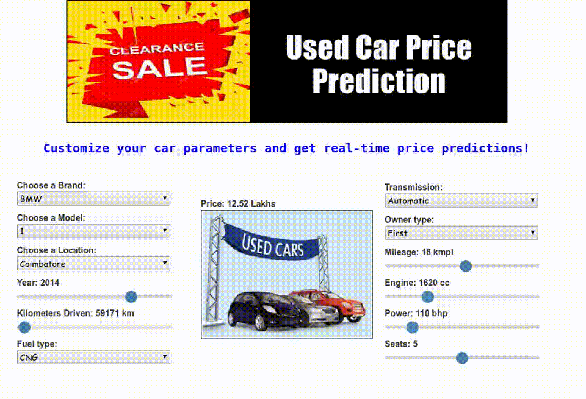
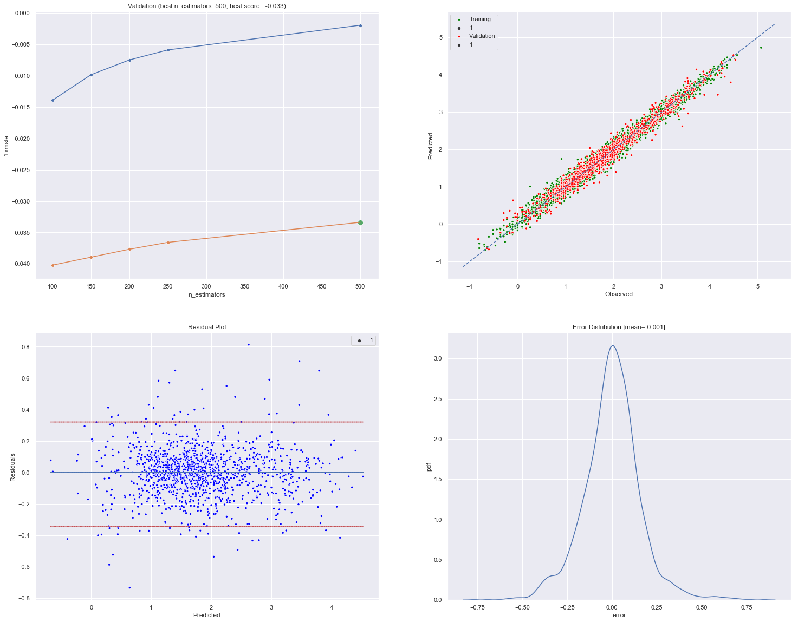

# Price prediction of used cars

- [Price prediction of used cars](#price-prediction-of-used-cars)
  - [Demo](#demo)
  - [Overview](#overview)
    - [Dataset Descrption](#dataset-descrption)
  - [key technical aspects](#key-technical-aspects)
  - [Best Model selection](#best-model-selection)
    - [Metric](#metric)
    - [Model Pipeline](#model-pipeline)
    - [Parameter search space](#parameter-search-space)
    - [Best parametes](#best-parametes)
    - [Validiton results:](#validiton-results)
    - [Feature importances](#feature-importances)
  - [Falsk App Deployment](#falsk-app-deployment)
  - [Technologies Used](#technologies-used)
  - [Creator:](#creator)

## Demo

AWS link: http://usedcarpricepredict-env.eba-jdefnbzx.us-east-1.elasticbeanstalk.com/



<center><i>working App developed using Flask</i></center><br>

## Overview
Cars are more than just a utility for many. We all have different tastes when it comes to owning a car or at least when thinking of owning one. Some fit in our budget and some lauxury brands are heavy on our pockets. But that should not stop us from owning it, atleast used ones. The goal of this project to predict the costs of used cars to enable the buyers to make informed purchase using the data collected from various sources and distributed across various locations in India.

### Dataset Descrption

Dataset used here is from a hackathon hosted by [MachineHack](https://www.machinehack.com/). Go to the hackathon [homepage]((https://www.machinehack.com/hackathons/5e8327d352c028cd80a0bd99)) to know more about the dataset. The dataset set contains features like Location, Manufacture details, car features such as Fuel type, Engine, and usage parameters. Below is the app in Working condition.

* Size of training set: 6,019 records | Size of test set: 1,234 records 
  
* **Features**: 
  - Name: The brand and model of the car. 
  - Location: The location in which the car is being sold or is available for purchase. 
  - Year: The year or edition of the model. 
  - Kilometers_Driven: The total kilometres driven in the car by the previous owner(s) in KM. 
  - Fuel_Type: The type of fuel used by the car. Transmission: The type of transmission used by the car. 
  - Owner_Type: Whether the ownership is Firsthand, Second hand or other. 
  - Mileage: The standard mileage offered by the car company in kmpl or km/kg 
  - Engine: The displacement volume of the engine in cc. 
  - Power: The maximum power of the engine in bhp. 
  - Seats: The number of seats in the car. 
  - New_Price: The price of a new car of the same model. 
  - Price: The price of the used car in INR Lakhs.

##  key technical aspects 

After data exploration and visualization various data prepossing steps are selected after of data. Following are noticeable ones among them.

- ```New_Price``` feature dropped due to significant missing values. 
- ```Name``` column split into ```Brand``` and ```Model``` features.
- Continuos variables including target feature are Log transformed to make their distribution symetrical.
-  ```Kilometers_Driven``` and ```Mileage``` are multiplied together to form new feature as this interaction show high correlation with target feature ```price```.
- ```Brand```,```Model```, and ```Location``` are encoded using **Target encoding** as they have lot of categories.
- ```Fuel_Type```, ```Transmission```, and ```Owner_Type``` are ```one-hot encoded```.
- ```Year``` columns are deducted by current year to introduce aging effect (current year - edition year).


## Best Model selection

The data is trained on Linear Regression, KNN, SVM, Decision Tree,Random Forest, GBDT and XGBoost with hyper-parmeter tuning. GBDT turns out be best model with lowest loss of 0.033.

### Metric 

* **Root Mean Squared Logarithmic Error** (RMSLE) is used as metric.

* RMSLE is usually used when you don't want to penalize huge differences in the predicted and the actual values when both predicted and true values are huge numbers. Rather we have to focus on percent error relative to the actual values.


### Model Pipeline 

``` python
pipeline = Pipeline([
    ('features',DFFeatureUnion([
        ('numerics', Pipeline([
            ('extract',ColumnExtractor(con_cols)),
            ('log', Log1pTransformer()),
            ('col_Interact',DFadd_ColInteraction('Kilometers_Driven','Mileage'))
        ])),
        ('nominal_OneHot',Pipeline([
            ('extract',ColumnExtractor(One_hot_cols)),
            ('dummy',DummyTransformer())])),
        ('nominal_Target', Pipeline([
            ('extract',ColumnExtractor(Tar_cols)),
            ('Mean_Enc',TargetEncoder())])),
        ('Year',Pipeline([
            ('extract',ColumnExtractor(Year)),
            ('Shift',ShiftTranformer(par=2019))])),
        ('Seats',Pipeline([
            ('extract',ColumnExtractor(Seats)),
            ('Select_OneHot',DF_OneHotEncoder(filter_threshold=0.05))]))
        ])),
    ('Model_fit',GradientBoostingRegressor())])
```

### Parameter search space
```py
pipe_params= {
    'Model_fit__n_estimators': [100,150,200,250,500,750],
    'Model_fit__learning_rate': [0.01,0.1,0.5,1],
    'Model_fit__subsample': [0.1,0.2,0.5,1.0],
}
```

### Best parametes

``` python
{'Model_fit__learning_rate': 0.1,
  'Model_fit__n_estimators': 500,
  'Model_fit__subsample': 0.5}
```

### Validiton results:



- Gradient boosting algo with lowest loss 0.033 is finally selected.

### Feature importances


## Falsk App Deployment 

All the files reqiured for setting up Flask deployment are in ```webapp``` folder. To deploy app in your local, Clone the git repo to local system and execute the following commands in your terminal setting project folder as working directory.

```sh
conda create -n CarPricePredict python=3.7 # create environment under 'CarPricePredict' name
conda activate CarPricePredict # activate environment
cd webApp/ # change directory to App deploymnet setup folder
pip3 install -r requirements.txt # install dependencies
python3 application.py # launch application
```


## Technologies Used


[](https://scikit-learn.org/stable/#)
[](https://flask.palletsprojects.com/en/1.1.x/) 
[](https://aws.amazon.com/s3/)
[]()
[](https://jquery.com/)
[](https://www.docker.com/)


--------------------------------------------

## Creator:

[](https://skumar-djangoblog.herokuapp.com/)